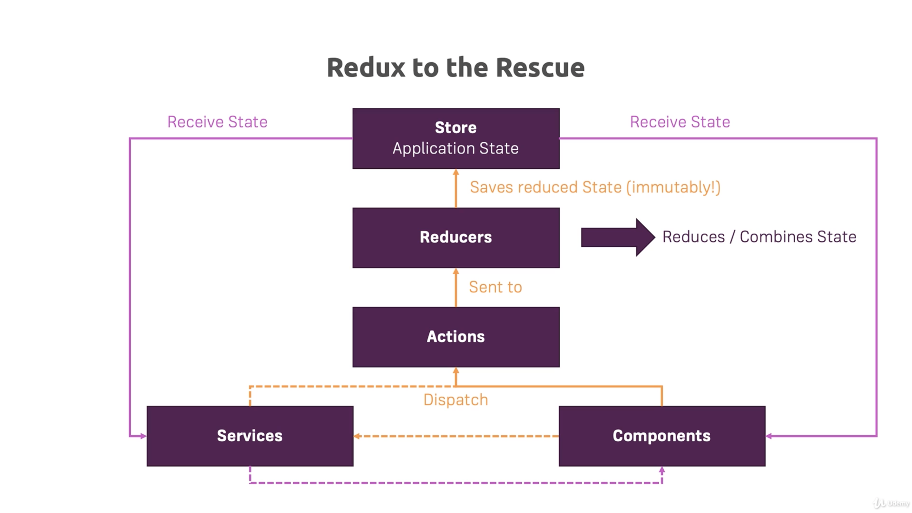

# Section 24 Working with NgRx

## NgRx

### Lesson 344 - Module Introduction

**NgRx** is a state management package maintained and developed by parts of the Angular team.

### Lesson 345 - What is Application State?

**State** refers to the data that controls what should be rendered on the screen. This data could refer to business data (e.g. `recipes`) or logic data (`isLoading`). The state is managed by memory, and is lost whenever the application is closed / refreshed.

**Application State** is a subset of State, and refers to only business related data.

To solve the refresh issue, we use a backend (server) to store a **Persistent State**. Whenever the application is loaded or refreshed, it would retrieve the persisted state from the backend.

The problem with this is that for larger apps, state management will get more complicated because more components and services are interacting with each other.

A part of the solution is `RxJS`, which provides features such as Observables and Operators, so the state change event can be emitted and subscribed. This is already a pretty good solution, but the downside is that developers need to keep track of the uni-direction data stream, and it will also be harder to modify this data stream.

### Lesson 346 - What is NgRx?

Downsides of using `RxJS` only is that there isn't a specific pattern enforced. Some effects are

- The state can be updated anywhere, which is hard to track
- State is possibly mutable. This leads to Angular not picking up the change of state because the state object's reference is unchanged
- The handling of side effects (e.g. Http calls) is unclear

**Redux** is a library that helps implement the **Redux Pattern**. The philosophy behind the Redux Pattern is that

- The application would use a single `Store` as a source of truth for the Application State
  - A `Store` can be thought of as a JS object
- The building blocks for the application can still interact with each other, but they will get the application state from the centralized `Store`
- When a building block needs to change the state, they **Dispatch** `Action`s
  - An `Action` can be viewed as a JS object that contains
    - An Identifier - Identify the kind of action to perform
    - A Payload (optional) - The data
- The dispatched `Action` gets sent to `Reducers`
  - A `Reducer` is a JS function that takes in
    - The current State (from the `Store`)
    - The `Action` (Passed in automatically by Redux library if it's used)
  - The `Reducer` will
    - Check the `Action` type using its identifier
    - Update the State in an Immutable way
      - I.e. Copy the State, perform updates on the copied state
    - Return the new State
- The returned State gets forwarded to the `Store` and the `Store` saves the reduced State

Redux Workflow:

The Redux Pattern provides a cleaner way of storing the application state because

- It provides a centralized place for storing app data
- The state is modified using `Actions` only
- The state is fetched using `Subscriptions` which the developers can set up

**NgRx** is the Angular implementation of the Redux Library. The main differences or added features are

- The NgRx implementation is deeply integrated into Angular
- It uses RxJS
- It uses TS instead of JS
- It allows side effect handling by listening to the `Action`s
