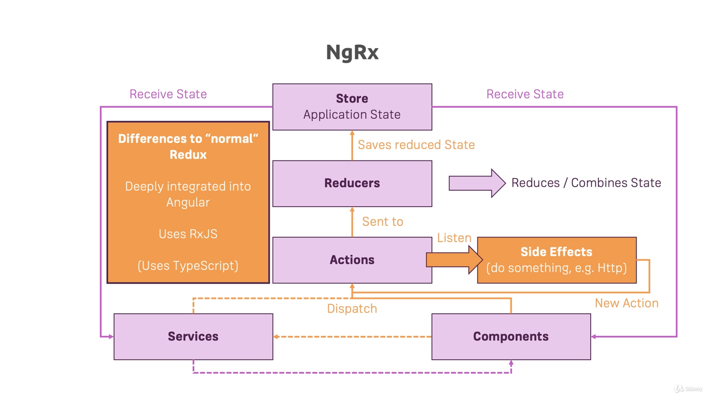

# Section 24 Working with NgRx

## NgRx

### Note

As of now (2021-03-07), to make everything compile, there are a few project setup items needed

- In `tsconfig`
  - The TS target version should be `"target": "es2015"`
    - Note this will be incompatible with IE 11
  - All `'strict'` settings should be false
- In `package.json`
  - The version for ngrx should be `"@ngrx/store": "^10.1.2"`

### Lesson 344 - Module Introduction

**NgRx** is a state management package maintained and developed by parts of the Angular team.

### Lesson 345 - What is Application State?

**State** refers to the data that controls what should be rendered on the screen. This data could refer to business data (e.g. `recipes`) or logic data (`isLoading`). The state is managed by memory, and is lost whenever the application is closed / refreshed.

**Application State** is a subset of State, and refers to only business related data.

To solve the refresh issue, we use a backend (server) to store a **Persistent State**. Whenever the application is loaded or refreshed, it would retrieve the persisted state from the backend.

The problem with this is that for larger apps, state management will get more complicated because more components and services are interacting with each other.

A part of the solution is `RxJS`, which provides features such as Observables and Operators, so the state change event can be emitted and subscribed. This is already a pretty good solution, but the downside is that developers need to keep track of the uni-direction data stream, and it will also be harder to modify this data stream.

### Lesson 346 - What is NgRx?

Downsides of using `RxJS` only is that there isn't a specific pattern enforced. Some effects are

- The state can be updated anywhere, which is hard to track
- State is possibly mutable. This leads to Angular not picking up the change of state because the state object's reference is unchanged
- The handling of side effects (e.g. Http calls) is unclear

**Redux** is a library that helps implement the **Redux Pattern**. The philosophy behind the Redux Pattern is that

- The application would use a single `Store` as a source of truth for the Application State
  - A `Store` can be thought of as a JS object
- The building blocks for the application can still interact with each other, but they will get the application state from the centralized `Store`
- When a building block needs to change the state, they **Dispatch** `Action`s
  - An `Action` can be viewed as a JS object that contains
    - An Identifier - Identify the kind of action to perform
    - A Payload (optional) - The data
- The dispatched `Action` gets sent to `Reducers`
  - A `Reducer` is a JS function that takes in
    - The current State (from the `Store`)
    - The `Action` (Passed in automatically by Redux library if it's used)
  - The `Reducer` will
    - Check the `Action` type using its identifier
    - Update the State in an Immutable way
      - I.e. Copy the State, perform updates on the copied state
    - Return the new State
- The returned State gets forwarded to the `Store` and the `Store` saves the reduced State

The Redux Pattern provides a cleaner way of storing the application state because

- It provides a centralized place for storing app data
- The state is modified using `Actions` only
- The state is fetched using `Subscriptions` which the developers can set up

**NgRx** is the Angular implementation of the Redux Library. The main differences or added features are

- The NgRx implementation is deeply integrated into Angular
- It uses RxJS
- It uses TS instead of JS
- It allows side effect handling by listening to the `Action`s

NgRx Workflow:



### Lesson 347 - Getting Started with Reducers

Install NgRx using `npm install --save @ngrx/store`

Create a `shopping-list.reducer.ts` file. In it

- Declare an initial state
  - Copy the `ingredients` list from `ShoppingListService`
- Define and export a function `shoppingListReducer`
  - This function will be used by NgRx when we introduce it
  - The function takes in
    - A `state`
      - Set the initial state as default argument
      - If the state is not set or null, then the `initialState` is used
    - An `action`

```ts
const initialState = {
  ingredients: [new Ingredient('Apples', 5), new Ingredient('Tomatoes', 10)],
};

export function shoppingListReducer(state = initialState, action) {}
```

### Lesson 348 - Adding Logic to the Reducer

In `shopping-list.reducer.ts`

- The reducer updates the state base on the type of action (`Action.type`).
  - The type is an action identifier defined by the developer and the convention is to use `UPPERCASE_NAMES`.
- The returned updated `State` must be an immutable update.
  - I.e. the state must be copied and updated instead of updating and returning the original state.
  - Use the `...object` syntax to copy the value from the object. This object can be a JS object or array.
- The data change will be encapsulated in the `Action`, which will be added in the next lecture

```ts
export function shoppingListReducer(state = initialState, action: Action) {
  switch (action.type) {
    case 'ADD_INGREDIENT':
      return {
        ...state,
        ingredients: [
          ...state.ingredients,
          action, // this is not yet correct
        ],
      };
  }
}
```

### Lesson 349 - Understanding & Adding Actions

With the `Reducer` set up, now we should set up `Action`s. In NgRx, `Action` is an interface that forces only a `type` identifier.

Create a `store` directory, create a `shopping-list.actions.ts`. In it

- Export a constant that represents the `ADD_INGREDIENT` action type identifier
- Export a `AddIngredient` class that implements NgRx `Action`
  - Implement the `type` parameter and define it as `ADD_INGREDIENT`
    - Make the `type` parameter `readonly`. This is similar to `final` in Java, which forbids any further modification to this property.
  - Include a `payload` property that carries the data, which will be the type of `Ingredient` in this case.

```ts
export const ADD_INGREDIENT = 'ADD_INGREDIENT';

export class AddIngredient implements Action {
  readonly type = ADD_INGREDIENT;
  payload: Ingredient;
}
```

Move `shopping-list.reducer.ts` to the `store` directory. In it

- Substitute the string action type with the constant defined in `shopping-list.actions.ts`

```ts
export function shoppingListReducer(state = initialState, action: Action) {
  switch (action.type) {
    case ADD_INGREDIENT:
      return {...};
  }
}
```

### Lesson 350 - Setting Up the NgRx Store

In `shopping-list.reducer.ts`

- Import everything from `shopping-list.actions.ts` by using `import * as ShoppingListActions from 'shopping-list.actions'`
- Properly use the payload in the AddIngredient action

```ts
import * as ShoppingListActions from './shopping-list.actions';
...
export function shoppingListReducer(
  state = initialState,
  action: ShoppingListActions.AddIngredient
) {
  switch (action.type) {
    case ShoppingListActions.ADD_INGREDIENT:
      return {
        ...state,
        ingredients: [...state.ingredients, action.payload],
      };
  }
}
```

To set up the store

In `app.module.ts`

- Import `StoreModule` from NgRx
- Use the `StoreModule.forRoot()` method to register the reducers
  - It takes in `ActionReducerMap` as input, which is just a JS object
    - The key is an arbitrary identifier that represents the feature the reducer will cover
    - The value is the actual reducer object

```ts
@NgModule({
  declarations: [ ... ],
  imports: [
    ...,
    StoreModule.forRoot({ shoppingList: shoppingListReducer }),
  ],
  bootstrap: [ ... ],
})
export class AppModule {}
```

### Lesson 351 - Selecting State

To use the state to get the shopping list ingredients

In `shopping-list.component.ts`

- Inject the store in the constructor
  - The `Store` object takes in type parameter as an JS object
    - The key is the identifier used in `AppModule`
    - The value is the return type (state type) of the reducer
- Modify `ingredients` to an `Observable`
- In `ngOnInit`, use `Store.select()` to select the slice of the state
  - The slice is identified as a string, which is the identifier mentioned above
  - The method returns an `Observable` of the type of the state type

```ts
@Component({
  selector: 'app-shopping-list',
  templateUrl: './shopping-list.component.html',
  styleUrls: ['./shopping-list.component.css'],
})
export class ShoppingListComponent implements OnInit, OnDestroy {
  ingredients: Observable<{ ingredients: Ingredient[] }>;

  constructor(
    ...,
    private store: Store<{ shoppingList: { ingredients: Ingredient[] } }>
  ) {}

  ngOnInit() {
    this.ingredients = this.store.select('shoppingList');
  }

  ngOnDestroy() {}
}
```

In `shopping-list.component.html`

- Modify the `*mgFor` to use a `async` pipe to resolve the `Observable`, and get the `ingredients` list after the observable is resolved

```html
<a
  class="list-group-item"
  style="cursor: pointer"
  *ngFor="let ingredient of (ingredients | async).ingredients; let i = index"
  (click)="onEditItem(i)"
>
  {{ ingredient.name }} ({{ ingredient.amount }})
</a>
```

In `shopping-list.reducer.ts`

- Add a `default` statement that returns the state when the action is unknown to avoid errors

```ts
export function shoppingListReducer(
  state = initialState,
  action: ShoppingListActions.AddIngredient
) {
  switch (action.type) {
    case ShoppingListActions.ADD_INGREDIENT:
      ...;
    default:
      return state;
  }
}
```

### Lesson 352 - Dispatching Actions

Another place to dispatch Actions in the app is in the shopping-edit component.

In `shopping-list.actions.ts`

- Use the constructor to include the `payload` property so all `AddIngredient` actions require it during construction

```ts
export class AddIngredient implements Action {
  readonly type = ADD_INGREDIENT;

  constructor(public payload: Ingredient) {}
}
```

In `shopping-edit.component.ts`

- Instead of using the service to add an ingredient, dispatch an `AddIngredient` action using `Store.dispatch`
  - `Store.dispatch()` takes in an action, and does not return anything

```ts
@Component({ ... })
export class ShoppingEditComponent implements OnInit, OnDestroy {
  constructor(
    ...,
    private store: Store<{ shoppingList: { ingredients: Ingredient[] } }>
  ) {}

  onSubmit(formElement: NgForm) {
    ...;
    if (this.editMode) {
      ...;
    } else {
      this.store.dispatch(new ShoppingListActions.AddIngredient(newIngredient));
    }
    ...;
  }
}
```

The workflow of dispatching an action

1. An `Action` is dispatched using `Store.dispatch()`
2. The Action reaches all the registered Reducers (Registered using `StoreModule.forRoot({identifier: reducer})`)
   1. The action is passed in as the second argument in the Reducer function
   2. The Reducer checks the type of action and react correspondingly

### Lesson 353 - Multiple Actions

To add another action, e.g. Add multiple recipes

In `shopping-list.actions.ts`

- Add a new constant `ADD_INGREDIENTS` indicating the type of the new actions
- Add a new Action `AddIngredients`
  - Use the above type
  - Include `payload` of array of `Ingredient`s in the constructor
- Export a `type` of `ShoppingListActions`, which is a union of all possible Action types

```ts
export const ADD_INGREDIENTS = 'ADD_INGREDIENTS';

export class AddIngredients implements Action {
  readonly type = ADD_INGREDIENTS;

  constructor(public payload: Ingredient[]) {}
}

export type ShoppingListActions = AddIngredient | AddIngredients;
```

In `shopping-list.reducer.ts`

- React to the new action type
  - Use `...list` to unpack the list object to add all list item to the list

```ts
export function shoppingListReducer(
  state = initialState,
  action: ShoppingListActions.ShoppingListActions
) {
  switch (action.type) {
    case ShoppingListActions.ADD_INGREDIENTS:
      return {
        ...state,
        ingredients: [...state.ingredients, ...action.payload],
      };
    ...
  }
}
```

In `recipe.service.ts`

- Inject the store
- Use `Store.dispatch()` to dispatch the `AddIngredients` event

```ts
@Injectable({ ... })
export class RecipeService {
  constructor(
    ...,
    private store: Store<{ shoppingList: { ingredients: Ingredient[] } }>
  ) {}

  addIngredientToShoppingList(ingredients: Ingredient[]): void {
    this.store.dispatch(new ShoppingListActions.AddIngredients(ingredients));
  }
}
```

### Lesson 354 - Preparing Update & Delete Actions

In `shopping-list.actions.ts`

- Add `UpdateIngredients` Action, which takes in an object of index and ingredient as payload
- Add `DeleteIngredients` Action, which takes only the index as payload
- Add both Actions to the `ShoppingListActions` type

```ts
export const UPDATE_INGREDIENTS = 'UPDATE_INGREDIENTS';
export const DELETE_INGREDIENTS = 'DELETE_INGREDIENTS';

export class UpdateIngredients implements Action {
  readonly type = UPDATE_INGREDIENTS;

  constructor(public payload: { index: number; ingredient: Ingredient }) {}
}

export class DeleteIngredients implements Action {
  readonly type = DELETE_INGREDIENTS;

  constructor(public payload: number) {}
}

export type ShoppingListActions =
  | AddIngredient
  | AddIngredients
  | UpdateIngredients
  | DeleteIngredients;
```

### Lesson 355 - Updating & Deleting Ingredients

In `shopping-list.reducer.ts`

- Add logic to handle Action of type `UPDATE_INGREDIENTS`
  - Copy all objects and lists that will be modified
  - Note that NgRx forbids mutable modifications to the state, and this applies to objects stored in the state as well
  - I.e. the objects in the state must be copied and then modified
- Add logic to handle Action of type `DELETE_INGREDIENTS`
  - Use the `filter()` method, which returns a copy of the list, and only retain elements that evaluates to true in the passed in method

```ts
export function shoppingListReducer(
  state = initialState,
  action: ShoppingListActions.ShoppingListActions
) {
  switch (action.type) {
    case ShoppingListActions.UPDATE_INGREDIENTS:
      const ingredient = state.ingredients[action.payload.index];
      const updatedIngredient = {
        ...ingredient, // copy old data
        ...action.payload.ingredient, // overwrite with new data
      };
      const updatedIngredients = [...state.ingredients];
      updatedIngredients[action.payload.index] = updatedIngredient;
      return {
        ...state,
        ingredients: updatedIngredients,
      };
    case ShoppingListActions.DELETE_INGREDIENTS:
      return {
        ...state,
        ingredients: state.ingredients.filter(
          (_ingredient: Ingredient, index: number) => {
            return index !== action.payload;
          }
        ),
      };
    ...;
  }
}
```

In `shopping-edit.component.ts`

- Modify methods to dispatch Actions correctly

```ts
@Component({
  selector: 'app-shopping-edit',
  templateUrl: './shopping-edit.component.html',
  styleUrls: ['./shopping-edit.component.css'],
})
export class ShoppingEditComponent implements OnInit, OnDestroy {
  onSubmit(formElement: NgForm) {
    ...;
    if (this.editMode) {
      this.store.dispatch(
        new ShoppingListActions.UpdateIngredients({
          index: this.editedItemIndex,
          ingredient: newIngredient,
        })
      );
    } else {
      ...;
    }
    ...;
  }
  onDelete() {
    this.store.dispatch(
      new ShoppingListActions.DeleteIngredients(this.editedItemIndex)
    );
    ...;
  }
}
```

Note there is a bug where the page is displaying outdated states when editing an ingredient. This will be addressed in later lessons.

### Lesson 356 - Expanding the State

In `shopping-list.reducer.ts`

- Define an interface that describes the `State`
- Define an interface that describes the `AppState`
  - This is used when the `Store` is injected into other components

```ts
export interface State {
  ingredients: Ingredient[];
  editedIngredient: Ingredient;
  editedIngredientIndex: number;
}

export interface AppState {
  shoppingList: State;
}

const initialState: State = {
  ingredients: [new Ingredient('Apples', 5), new Ingredient('Tomatoes', 10)],
  editedIngredient: null,
  editedIngredientIndex: -1,
};
```

In `recipe.service.ts`, `shopping-edit.component.ts` and `shopping-list.component.ts`

- Use the `AppState` to replace the hard-coded type parameter when injecting the `Store`

```ts
import * as fromShoppingList from '.../shopping-list.reducer';

@Injectable({ ... })
export class RecipeService {
  constructor(private store: Store<fromShoppingList.AppState>) {}
}
```

### Lesson 357 - Managing More State via NgRx

The bug mentioned at the end of [Lesson 355](#lesson-355---updating--deleting-ingredients) is caused by `shopping-edit.component.ts` fetching target ingredient from `ShoppingListService` instead of the Store.

In `shopping-list.actions.ts`

- Create a `StartEdit` Action
  - Use the constructor to set the payload as the index of the `Ingredient` to edit
- Create a `StopEdit` Action
  - No need to add a payload because the Reducer does not need any information to reset the state
- Add the two actions to the `ShoppingListActions` type definition

```ts
export const START_EDIT = 'START_EDIT';
export const STOP_EDIT = 'STOP_EDIT';

export class StartEdit implements Action {
  readonly type = START_EDIT;

  constructor(public payload: number) {}
}

export class StopEdit implements Action {
  readonly type = STOP_EDIT;
}

export type ShoppingListActions =
  | AddIngredient
  | AddIngredients
  | UpdateIngredients
  | DeleteIngredients
  | StartEdit
  | StopEdit;
```

In `shopping-list.reducer.ts`

- Add logic to process Action type of `START_EDIT`
  - Copy the state
  - Set the `editedIngredientIndex` using the payload
  - Set the `editedIngredient` using the index and the state's ingredients list
    - Note that the ingredient needs to be copied to avoid mutable edits
- Add logic to process Action type of `STOP_EDIT`
  - Copy the state
  - Reset `editedIngredientIndex` and `editedIngredient`

```ts
export function shoppingListReducer(
  state: State = initialState,
  action: ShoppingListActions.ShoppingListActions
): State {
  switch (action.type) {
    ...;
    case ShoppingListActions.START_EDIT:
      return {
        ...state,
        editedIngredientIndex: action.payload,
        editedIngredient: { ...state.ingredients[action.payload] },
      };
    case ShoppingListActions.STOP_EDIT:
      return {
        ...state,
        editedIngredient: null,
        editedIngredientIndex: -1,
      };
  }
```

In `shopping-list.component.ts`

- Dispatch `StartEdit` Action when the item is edited

```ts
@Component({ ... })
export class ShoppingListComponent implements OnInit, OnDestroy {
  onEditItem(index: number) {
    this.store.dispatch(new ShoppingListActions.StartEdit(index));
  }
}
```

In `shopping-edit.component.ts`

- In `ngOnInit`
  - Fetch the `State` data from the store
  - Base on the store, set the edit mode
  - If the store contains valid edit data, then set the editedItem and the form values
- In `onClear` and `ngOnDestroy`
  - Dispatch `StopEdit` Action to clear the `State`'s edit data

```ts
@Component({ ... })
export class ShoppingEditComponent implements OnInit, OnDestroy {
  ngOnInit() {
    this.startedEditingSubscription = this.store
      .select('shoppingList')
      .subscribe((stateData: fromShoppingList.State) => {
        if (stateData.editedIngredientIndex > -1) {
          this.editMode = true;
          this.editedItem = stateData.editedIngredient;
          this.shoppingListForm.setValue({
            name: this.editedItem.name,
            amount: this.editedItem.amount,
          });
        } else {
          this.editMode = false;
        }
      });
  }

  onClear() {
    ...;
    this.store.dispatch(new ShoppingListActions.StopEdit());
  }

  ngOnDestroy(): void {
    ...;
    this.store.dispatch(new ShoppingListActions.StopEdit());
  }
}
```

This introduces another bug - the edit and delete actions are dispatched and processed by the Reducer, but the changes to the state are no longer reflected on the page. This will be addressed in a later lesson

### Lesson 358 - Removing Redundant Component State Management

The bug mentioned at the end of [lesson 357](#lesson-357---managing-more-state-via-ngrx) is caused by `shopping-edit.component.ts`'s editedItemIndex not being updated / set during `ngOnInit`.

One fix is to set it by `this.editedItemIndex = stateData.editedIngredientIndex;`, but this is redundant because this is extracting data from the `Store`, and later in the application, the `Store` also relies on this data to set the new `State`. Thus it is appropriate to remove it all at once.

In `shopping-list.actions.ts`

- Remove the need for index in `UpdateIngredient` and `DeleteIngredient` Actions

```ts
export class UpdateIngredients implements Action {
  readonly type = UPDATE_INGREDIENTS;

  constructor(public payload: Ingredient) {}
}

export class DeleteIngredients implements Action {
  readonly type = DELETE_INGREDIENTS;
}
```

In `shopping-list.reducer.ts`

- Update logic to respond to `UpdateIngredient` and `DeleteIngredient` Actions
  - Use the index in the `Store` instead of in the payload

```ts
export function shoppingListReducer(
  state: State = initialState,
  action: ShoppingListActions.ShoppingListActions
): State {
  switch (action.type) {
    ...;
    case ShoppingListActions.UPDATE_INGREDIENTS:
      const ingredient = state.ingredients[state.editedIngredientIndex];
      const updatedIngredient = {
        ...ingredient, // copy old data
        ...action.payload, // overwrite with new data
      };
      const updatedIngredients = [...state.ingredients];
      updatedIngredients[state.editedIngredientIndex] = updatedIngredient;
      return {
        ...state,
        ingredients: updatedIngredients,
        editedIngredientIndex: -1,
        editedIngredient: null,
      };
    case ShoppingListActions.DELETE_INGREDIENTS:
      return {
        ...state,
        ingredients: state.ingredients.filter(
          (_ingredient: Ingredient, index: number) => {
            return index !== state.editedIngredientIndex;
          }
        ),
        editedIngredientIndex: -1,
        editedIngredient: null,
      };
    ...;
  }
```

In `shopping-edit.component.ts`

- Dispatch the `UpdateIngredients` and `DeleteIngredients` Actions properly

```ts
@Component({ ... })
export class ShoppingEditComponent implements OnInit, OnDestroy {
  onSubmit(formElement: NgForm) {
    ...;
    if (this.editMode) {
      this.store.dispatch(
        new ShoppingListActions.UpdateIngredients(newIngredient)
      );
    } else {
      ...;
    }
    ...;
  }

  onDelete() {
    this.store.dispatch(new ShoppingListActions.DeleteIngredients());
    ...;
  }
}
```

### Lesson 359 - First Summary & Clean Up

Thus far, what we did are

- Import `StoreModule` in `AppModule`
  - Register the Reducer using `StoreModule.forRoot({ identifier: reducer })`
- Add a Reducer `shopping-list.reducer.ts`
  - Reducer is just a function that takes in a State and an Action and returns a new State (immutable)
  - Use a switch-case statement to check the Action's type and generate the new state accordingly
  - No asynchronous code in the Reducer
- Add an Actions file `shopping-list.actions.ts`
  - Define Action type identifiers
  - Define Actions implementing `Action`
  - Optionally accept payload data

Cons of using NgRx Store (compared to using services)

- More overhead setting up Reducer and Actions

Pros of using NgRx Store (compared to using services)

- Easy to grow the Reducer and Actions once they are set up
- Easier to manage the state as the state gets larger

Now all the states related to `shopping-list.service.ts` are managed by NgRx, all references to the ShoppingListService can be safely removed / commented out.

### Lesson 360 - One Root State

Create a `auth/store` directory, and create `auth.reducer.ts`. In it

- Define and export `State` interface
- Set up `initialState`
- Set up simple `authReducer`

```ts
export interface State {
  user: User;
}

const initialState: State = {
  user: null,
};

export function authReducer(state: State = initialState, action) {
  return state;
}
```

Create `store` directory at root level, and create `app.reducer.ts`. In it

- Define and export interface `AppState`
  - The key is the Reducer identifier
  - The value is the `State` interface defined in each Reducer
- Define and export the `ActionReducerMap`
  - The type parameter is the `AppState`
  - The key is the Reducer identifier
  - The value is the Reducer function

```ts
export interface AppState {
  shoppingList: fromShoppingList.State;
  auth: fromAuth.State;
}

export const appReducer: ActionReducerMap<AppState> = {
  shoppingList: fromShoppingList.shoppingListReducer,
  auth: fromAuth.authReducer,
};
```

In `app.module.ts`

- Declare the Reducers using the `ActionReducerMap` defined in `app.reducer.ts`

```ts
@NgModule({
  declarations: [ ... ],
  imports: [
    ...,
    StoreModule.forRoot(fromApp.appReducer),
  ],
  bootstrap: [ ... ],
})
export class AppModule {}
```

Remove `AppState` defined in `shopping-list.reducer.ts` since it is no longer required.

Update `AppState` type parameter in `shopping-edit.component.ts`, `shopping-list.component.ts` and `recipe.service.ts`.

### Lesson 361 - Setting Up Auth Reducer & Actions

Create `auth.actions.ts`. In it

- Declare and export `Login` Action
  - Declare the type
  - Set the payload as an object containing all necessary fields to create a user
- Declare and export `Logout` Action
  - Declare the type
  - No payload necessary

```ts
export const LOGIN = 'LOGIN';
export const LOGOUT = 'LOGOUT';

export class Login implements Action {
  readonly type = LOGIN;

  constructor(
    public payload: {
      email: string;
      userId: string;
      token: string;
      expirationDate: Date;
    }
  ) {}
}

export class Logout implements Action {
  readonly type = LOGOUT;
}

export type AuthActions = Login | Logout;
```

In `auth.reducer.ts`

- Implement logic to respond to `Login` Action
  - Create a user and set it as the user in the new state
- Implement logic to respond to `Login` Action
  - Set the state user to null

```ts
export function authReducer(
  state: State = initialState,
  action: AuthActions.AuthActions
): State {
  switch (action.type) {
    case AuthActions.LOGIN:
      const user = new User(
        action.payload.email,
        action.payload.userId,
        action.payload.token,
        action.payload.expirationDate
      );
      return {
        ...state,
        user: user,
      };
    case AuthActions.LOGOUT:
      return {
        ...state,
        user: null,
      };
    default:
      return state;
  }
}
```

### Lesson 362 - Dispatching Auth Actions

In `auth.service.ts`

- Inject Store
- Replace all `user.next()` with `Store.dispatch()`

```ts
@Injectable({ ... })
export class AuthService {
  constructor(
    ...,
    private store: Store<fromApp.AppState>
  ) {}

  autoLogin(): void {
    ...;
    if (!userData) {
      return;
    } else {
      ...;
      if (loadedUser.token) {
        // this.user.next(loadedUser);
        this.store.dispatch(
          new AuthActions.Login({
            email: loadedUser.email,
            userId: loadedUser.id,
            token: loadedUser.token,
            expirationDate: new Date(userData._tokenExpirationDate),
          })
        );
        ...;
      }
    }
  }

  logout(): void {
    // this.user.next(null);
    this.store.dispatch(new AuthActions.Logout());
    ...;
  }

  private handleAuthenticationResponse(
    email: string,
    userId: string,
    token: string,
    expiresIn: number
  ): void {
    ...;
    // this.user.next(user);
    this.store.dispatch(
      new AuthActions.Login({
        email: email,
        userId: userId,
        token: token,
        expirationDate: expirationDate,
      })
    );
    ...;
  }
}
```

### Lesson 363 - Auth Finished (For Now...)

In `auth.service.ts`

- Comment out the `user` `BehaviorSubject` since all states should be managed by NgRx

In `auth-interceptor.service.ts`, `auth.guard.ts`, `header.component.ts`

- Inject the Store
- Instead of using `AuthService.user`, use the store to select the slice of the state
- Use `pipe` and `map` to map them to the correct data type so it can be processed as before

```ts
// return this.authService.user.pipe(
return this.store.select('auth').pipe(
  take(1),
  map((authState: fromAuth.State) => {
    return authState.user;
  }),
  ...
)
```

### Lesson 364 - An Important Note on Actions

When the app starts up NgRx will dispatch an action with a special type. This type is not handled by our Reducers at the moment, and thus the `default` case is required to return the original state.

It is also important to add the `default` case because dispatched actions will reach _All_ reducers. If the `default` case is not specified, the reducer may not recognize the action and not return anything, and the state will be broken.

Another thing to remember is that the Action identifiers' values should be unique across all Actions in the application. To avoid this, NgRx has a common pattern - **prefixing**. By prefixing the identifier with `[Feature Name]`, it ensures that no two features will have the same identifier name by accident. The common pattern also uses plain English text (with spaces) in the identifier.

In `auth.actions.ts`

```ts
export const LOGIN = '[Auth] Login';
export const LOGOUT = '[Auth] Logout';
```

### Lesson 365 - Exploring NgRx Effects

Side effects in NgRx applications are code or logic that are irrelevant to the immediate update of the state. For example, during the auth sign-up logic, the code for posting the Http Request are side effects, where as the code for processing the request response and storing the signed-up user in the state is not. NgRx does not care about the side effects, so the Actions and Reducers should not include side effect code.

To deal with these side effects, NgRx provides the `@ngrx/effects`. This needs to be installed through `npm install --save @ngrx/effects`. It provides a solution to elegantly work with side effects while keeping Actions and Reducers clean.

### Lesson 366 - Defining the First Effect

In `auth.actions.ts`

- Create an Action type of `LOGIN_START`

```ts
export const LOGIN_START = '[Auth] Login Start';
```

In `auth/store`, create an `auth.effects.ts`. In it

- Create and export an `AuthEffects` class
- Define a property of `actions$: Actions` in the constructor
  - `Actions` is an Observable provided by `@ngrx/effects` that gives access to all the dispatched actions
  - The `$` sign is a naming convention for variables of type `Observable`
- An Effect is a property of the class of type Observable
  - It is obtained by filtering on the Action type in the `actions$` property
  - `ofType()` is an operator provided by `@ngrx/effects`. It defines a filter for the kinds of effects the effect is targeting.

```ts
export class AuthEffects {
  authLogin = this.actions$.pipe(ofType(AuthActions.LOGIN_START));

  constructor(private actions$: Actions) {}
}
```

### Lesson 367 - Effects & Error Handling

In `auth.actions.ts`

- Create a `LoginStart` Action
  - The constructor takes in a payload with email and password

```ts
export class LoginStart implements Action {
  readonly type = LOGIN_START;

  constructor(public payload: { email: string; password: string }) {}
}
```

In `auth.effects.ts`

- To make `authLogin` a proper Effect, use the `@Effect()` decorator
- Use `switchMap` to emit the Http Post request
  - Recall that the `switchMap` operator maps the current Observable to an inner Observable and eventually emits the data in the inner Observable
- Note that in the effect, we cannot catch the error thrown by the Http request using `catchError` (as in `AuthService`) because
  - `catchError` terminates the Observable stream, which terminates the Observable
  - In the service, the Observable is created whenever the method is called, so terminating it is ok
  - In the effect, the Observable is created only once, and should live until we explicitly terminate it or until the application ends, so that it can react to other actions of the same type.
- To handle the error, use `pipe()` in the inner Observable, and use `catchError` and `map` in the inner pipe
  - Note that the `catchError` operator must not return an error, so the effect stays alive
  - Use `of()` to return a new observable
    - `of` is an RxJS operator that returns an observable
    - The content of `of` and the return statement will be covered in the next lesson

```ts
export interface AuthResponseData {
  kind?: string;
  idToken: string;
  email: string;
  refreshToken: string;
  expiresIn: string;
  localId: string;
  registered?: boolean;
}

export class AuthEffects {
  @Effect()
  authLogin = this.actions$.pipe(
    ofType(AuthActions.LOGIN_START),
    switchMap((authData: AuthActions.LoginStart) => {
      return this.http
        .post<AuthResponseData>(FirebaseConfigs.SIGN_IN_URL, {
          email: authData.payload.email,
          password: authData.payload.password,
          returnSecureToken: true,
        })
        .pipe(
          catchError((error) => {
            of();
          }),
          map((responseData) => {
            of();
          })
        );
    })
  );

  constructor(private actions$: Actions, private http: HttpClient) {}
}
```

### Lesson 368 - Login via NgRx Effects

In `app.module.ts`

- Import `EffectsModule`
  - Use `EffectsModule.forRoot([])` to register a list of Effects

```ts
@NgModule({
  declarations: [ ... ],
  imports: [
    ...,
    EffectsModule.forRoot([AuthEffects]),
  ],
  bootstrap: [ ... ],
})
export class AppModule {}
```

In `auth.effects.ts`

- Use `@Injectable()` to allow injections into `AuthEffects`
- Use `map()` to populate an `AuthActions.Login` action after the side-effect (login request) completes successfully

```ts
@Injectable()
export class AuthEffects {
  @Effect()
  authLogin = this.actions$.pipe(
    ofType(AuthActions.LOGIN_START),
    switchMap((authData: AuthActions.LoginStart) => {
      return this.http
        .post<AuthResponseData>(FirebaseConfigs.SIGN_IN_URL, {
          email: authData.payload.email,
          password: authData.payload.password,
          returnSecureToken: true,
        })
        .pipe(
          map((responseData: AuthResponseData) => {
            const expirationDate = new Date(
              new Date().getTime() + +responseData.expiresIn * 1000
            );
            return of(
              new AuthActions.Login({
                email: responseData.email,
                userId: responseData.localId,
                token: responseData.idToken,
                expirationDate: expirationDate,
              })
            );
          }),
          catchError((error) => {
            // ...
            // returns an empty observable for now
            return of();
          })
        );
    })
  );
}
```

In `auth.component.ts`

- Use the Store to dispatch a `LoginStart` Action
  - The `LoginStart` Action will not be processed by the reducer (it will be processed using the default case), it will be captured by the Effects defined above because of the `ofType` filter

```ts
@Component({ ... })
export class AuthComponent implements OnInit, OnDestroy {
  onSubmit(authForm: NgForm): void {
    if (!authForm.valid) {
      ...;
    } else {
      ...;
      if (this.isLoginMode) {
        this.store.dispatch(
          new AuthActions.LoginStart({ email: email, password: password })
        );
      } else {
        ...;
      }
      ...;
    }
  }
}
```

### Lesson 369 - Managing UI State in NgRx

In `auth.actions.ts`

- Add a `LoginFail` Action and export it as one of the `AuthActions` types

```ts
export const LOGIN_FAIL = '[Auth] Login Fail';
export class LoginFail implements Action {
  readonly type = LOGIN_FAIL;

  constructor(public payload: string) {}
}
export type AuthActions = LoginSuccess | Logout | LoginStart | LoginFail;
```

In `auth.reducer.ts`

- Expand the state to include `authError` and `loading`
- Update existing cases to reset `authError` and `loading` to `null`
- Add cases to handle `LoginFail` Action

```ts
export interface State {
  user: User;
  authError: string;
  loading: boolean;
}

const initialState: State = {
  user: null,
  authError: null,
  loading: false,
};

export function authReducer(
  state: State = initialState,
  action: AuthActions.AuthActions
): State {
  switch (action.type) {
    case AuthActions.LOGIN_FAIL:
      return {
        ...state,
        user: null,
        authError: action.payload,
        loading: false,
      };
    ...;
  }
```

In `auth.component.ts`

- In stead of subscribing to the Http requests from the service in `onSubmit`, subscribe to the store's auth State in `ngOnInit` and update the attributes accordingly

```ts
@Component({ ... })
export class AuthComponent implements OnInit, OnDestroy {
  ngOnInit(): void {
    this.store.select('auth').subscribe((authState: fromAuth.State) => {
      this.isLoading = authState.loading;
      this.error = authState.authError;
    });
  }
}
```

### Lesson 370 - Finishing the Login Effect

In `auth.effects.ts`

- Update the `authLogin` Effect to
  - Return the `LoginSuccess` Action in the `map` method without using `of` to make it an Observable, since `map` already returns an Observable
  - In `catchError`, copy the error handling logic from `AuthService.handleError()`
    - Instead of returning `throwError()`, return a `LoginFail` Action wrapped in `of()` to make it an observable
- Add `authSuccess` Effect to
  - Listen to `LOGIN_SUCCESS` Actions using `ofType()`
  - Navigate to the root path
- Note the `authSuccess` Effect does not dispatch another Action because it is not necessary.
  - To let NgRx know that the Effect does not need to dispatch any Action, use `@Effect({ dispatch: false })`

```ts
@Injectable()
export class AuthEffects {
  @Effect()
  authLogin = this.actions$.pipe(
    ofType(AuthActions.LOGIN_START),
    switchMap((authData: AuthActions.LoginStart) => {
      return this.http
        .post<AuthResponseData>(...)
        .pipe(
          map((responseData: AuthResponseData) => {
            ...;
            return new AuthActions.LoginSuccess({ ... });
          }),
          catchError((errorResponse: HttpErrorResponse) => {
            let errorMessage = 'An unknown error occurred!';
            if (errorResponse?.error?.error) {
              switch (errorResponse.error.error.message) {
                case 'EMAIL_EXISTS': {
                  errorMessage = 'This email already exists!';
                  break;
                }
                case 'EMAIL_NOT_FOUND': {
                  errorMessage = 'This email does not exist!';
                  break;
                }
                case 'INVALID_PASSWORD': {
                  errorMessage = 'This password is incorrect!';
                  break;
                }
              }
            }
            return of(new AuthActions.LoginFail(errorMessage));
          })
        );
    })
  );

  @Effect({ dispatch: false })
  authSuccess = this.actions$.pipe(
    ofType(AuthActions.LOGIN_SUCCESS),
    tap(() => {
      this.router.navigate(['/']);
    })
  );
}
```

### Lesson 371 - Preparing Other Auth Actions

In `auth.actions`

- Add `SignUpSignUpStart` Action
- Rename `LoginSuccess` and `LoginFail` to `AuthenticateSuccess` and `AuthenticateFail`, since the logic is shared between `Login` and `SignUp`

```ts
export const SIGN_UP_START = '[Auth] Sign Up Start';
export class SignUpStart implements Action {
  readonly type = SIGN_UP_START;

  constructor(public payload: { email: string; password: string }) {}
}
```

Update references across the application.

In `auth.effects.ts`

- Add a skeleton effect to listen to `SignUpStart` events

```ts
@Injectable()
export class AuthEffects {
  @Effect()
  authSignUp = this.actions$.pipe(ofType(AuthActions.SIGN_UP_START));
}
```

### Lesson 372 - Adding Sign-up

In `auth.effects.ts`

- Fill in logic for `authSignUp` Effect
- Extract common logic to refactor the code

```ts
const handleAuthentication = (email, userId, token, expiresIn) => {
  ...;
  return new AuthActions.AuthenticateSuccess({ ... });
};

const handleError = (errorResponse: HttpErrorResponse) => {
  ...;
  return of(new AuthActions.AuthenticateFail(errorMessage));
};

@Injectable()
export class AuthEffects {
  @Effect()
  authSignUp = this.actions$.pipe(
    ofType(AuthActions.SIGN_UP_START),
    switchMap((signUpAction: AuthActions.SignUpStart) => {
      return this.http
        .post<AuthResponseData>(...)
        .pipe(
          map((responseData: AuthResponseData) => {
            return handleAuthentication(
              responseData.email,
              responseData.localId,
              responseData.idToken,
              +responseData.expiresIn
            );
          }),
          catchError((errorResponse: HttpErrorResponse) => {
            return handleError(errorResponse);
          })
        );
    })
  );

  @Effect()
  authLogin = this.actions$.pipe(
    ofType(AuthActions.LOGIN_START),
    switchMap((authData: AuthActions.LoginStart) => {
      return this.http
        .post<AuthResponseData>(...)
        .pipe(
          map((responseData: AuthResponseData) => {
            return handleAuthentication(
              responseData.email,
              responseData.localId,
              responseData.idToken,
              +responseData.expiresIn
            );
          }),
          catchError((errorResponse: HttpErrorResponse) => {
            return handleError(errorResponse);
          })
        );
    })
  );
  ...
}
```

In `auth.component.ts`

- Use NgRx to replace existing logic to dispatch SignUp requests

```ts
@Component({ ... })
export class AuthComponent implements OnInit, OnDestroy {
  onSubmit(authForm: NgForm): void {
    if (!authForm.valid) {
      return;
    } else {
      ...;
      if (this.isLoginMode) {
        ...;
      } else {
        this.store.dispatch(
          new AuthActions.SignUpStart({ email: email, password: password })
        );
      }
      authForm.reset();
    }
  }
}
```

### Lesson 373 - Further Auth Effects

In `auth.actions.ts`

- Create a `ClearError` Action

```ts
export const CLEAR_ERROR = '[Auth] Clear Error';
export class ClearError implements Action {
  readonly type = CLEAR_ERROR;
}
export type AuthActions =
  | SignUpStart
  | LoginStart
  | AuthenticateSuccess
  | AuthenticateFail
  | Logout
  | ClearError;
```

In `auth.reducer.ts`

- Process the `SIGN_UP_START` case by extending the `LOGIN_START` case
- Process the `CLEAR_ERROR` case by setting the `authError` to `null`

```ts
export function authReducer(
  state: State = initialState,
  action: AuthActions.AuthActions
): State {
  switch (action.type) {
    case AuthActions.SIGN_UP_START:
    case AuthActions.LOGIN_START:
      return {
        ...state,
        authError: null,
        loading: true,
      };
    case AuthActions.CLEAR_ERROR:
      return {
        ...state,
        authError: null,
      };
    ...;
  }
```

In `auth.component.ts`

- Subscribe and unsubscribe to store subscriptions
- Handle the error close method using the store

```ts
@Component({ ... })
export class AuthComponent implements OnInit, OnDestroy {
  private storeSubscription: Subscription;

  ngOnInit(): void {
    this.storeSubscription = this.store
      .select('auth')
      .subscribe(...);
  }

  onAlertClosed(): void {
    this.store.dispatch(new AuthActions.ClearError());
  }

  ngOnDestroy(): void {
    if (this.storeSubscription) {
      this.storeSubscription.unsubscribe();
    }
  }
}
```

In `auth.effects.ts`

- Rename `authSuccess` to `authRedirect`
  - Listen to both `AUTHENTICATE_SUCCESS` and `LOGOUT_SUCCESS` Actions
  - Redirect accordingly

```ts
@Injectable()
export class AuthEffects {
  @Effect({ dispatch: false })
  authRedirect = this.actions$.pipe(
    ofType(AuthActions.AUTHENTICATE_SUCCESS, AuthActions.LOGOUT_SUCCESS),
    tap((authAction: AuthActions.AuthActions) => {
      if (authAction.type === AuthActions.AUTHENTICATE_SUCCESS) {
        this.router.navigate(['/']);
      } else if (authAction.type === AuthActions.LOGOUT_SUCCESS) {
        this.router.navigate(['/auth']);
      }
    })
  );
}
```

In `header.component.ts`

- Use the store to dispatch the `Logout` Action instead of using `AuthService`

```ts
@Component({ ... })
export class HeaderComponent implements OnInit, OnDestroy {
  onLogout(): void {
    this.store.dispatch(new AuthActions.Logout())
  }
}
```

In `auth.service.ts`

- Remove the `login` and `signUp` methods since they are no longer needed

### Lesson 374 - Adding Auto-Login with NgRx

In `auth.actions.ts`

- Create an `AutoLogin` Action

```ts
export const AUTO_LOGIN = '[Auth] Auto Login';
export class AutoLogin implements Action {
  readonly type = AUTO_LOGIN;
}
```

In `auth.effects.ts`

- Store the current user in localStorage when the authentication request returns successful
- Create an `autoLogin` Effect to listen to `AUTO_LOGIN` Actions
  - Copy the logic from `AuthService.autoLogin()`
  - Return dummy Action if the data is invalid
  - Comment out logic to auto logout for now
- Create an `authLogout` Effect to listen to `LOGOUT_SUCCESS` Actions
  - Reset local storage
  - No need to dispatch another action

```ts
const handleAuthentication = (email, userId, token, expiresIn) => {
  ...;
  const user = new User(email, userId, token, expirationDate);
  localStorage.setItem(userDataKey, JSON.stringify(user));
  return new AuthActions.AuthenticateSuccess({ ... });
};

@Injectable()
export class AuthEffects {
  @Effect()
  autoLogin = this.actions$.pipe(
    ofType(AuthActions.AUTO_LOGIN),
    map(() => {
      const userData: {
        email: string;
        id: string;
        _token: string;
        _tokenExpirationDate: string;
      } = JSON.parse(localStorage.getItem(userDataKey));
      if (!userData) {
        return { type: 'NOOP' };
      } else {
        const loadedUser = new User(
          userData.email,
          userData.id,
          userData._token,
          new Date(userData._tokenExpirationDate)
        );

        if (loadedUser.token) {
          // this.user.next(loadedUser);
          return new AuthActions.AuthenticateSuccess({
            email: loadedUser.email,
            userId: loadedUser.id,
            token: loadedUser.token,
            expirationDate: new Date(userData._tokenExpirationDate),
          });
          // const expirationDuration =
          //   new Date(userData._tokenExpirationDate).getTime() -
          //   new Date().getTime();
          // this.autoLogout(expirationDuration);
        } else {
          return { type: 'NOOP' };
        }
      }
    })
  );

  @Effect({ dispatch: false })
  authLogout = this.actions$.pipe(
    ofType(AuthActions.LOGOUT_SUCCESS),
    tap(() => {
      localStorage.removeItem(userDataKey);
    })
  );
}
```

### Lesson 375 - Adding Auto-Logout

Since all auth-related logic has been replaced with NgRx management, the `AuthService` should only handle the logout timer.

In `auth.service.ts`

- Rename `autoLogout` to `setLogoutTimer` that dispatches the `Logout` Action
- Create a `clearLogoutTimer` method that clears the timer

```ts
@Injectable({ ... })
export class AuthService {
  private tokenExpirationTimer: any;

  constructor(private store: Store<fromApp.AppState>) {}

  setLogoutTimer(expirationDuration: number): void {
    this.tokenExpirationTimer = setTimeout(() => {
      this.store.dispatch(new AuthActions.Logout());
    }, expirationDuration);
  }

  clearLogoutTimer() {
    if (this.tokenExpirationTimer) {
      clearTimeout(this.tokenExpirationTimer);
      this.tokenExpirationTimer = null;
    }
  }
}
```

In `auth.effects.ts`

- Use `tap()` to set the timer when the user is authenticated or auto-logged in
- Stop listening to `LOGOUT` Actions in the `authRedirect` Effect
- In the `authLogout` Effect
  - Clear the logout timer
  - Navigate to the auth page `/auth`

```ts
@Injectable()
export class AuthEffects {
  @Effect()
  authSignUp = this.actions$.pipe(
    ofType(AuthActions.SIGN_UP_START),
    switchMap((signUpAction: AuthActions.SignUpStart) => {
      return this.http
        .post<AuthResponseData>(...)
        .pipe(
          tap((responseData: AuthResponseData) => {
            this.authService.setLogoutTimer(+responseData.expiresIn * 1000);
          }),
          ...;
        );
    })
  );

  @Effect({ dispatch: false })
  authRedirect = this.actions$.pipe(
    ofType(AuthActions.AUTHENTICATE_SUCCESS),
    tap(() => {
      this.router.navigate(['/']);
    })
  );

  @Effect({ dispatch: false })
  authLogout = this.actions$.pipe(
    ofType(AuthActions.LOGOUT_SUCCESS),
    tap(() => {
      this.authService.clearLogoutTimer();
      localStorage.removeItem(userDataKey);
      this.router.navigate(['/auth']);
    })
  );
}
```

### Lesson 376 - Finishing the Auth Effects

Cleanup all component and services since all auth logic is managed by NgRx
