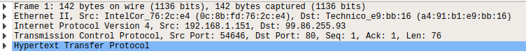

# Introductory Networking

[Introductory Networking](https://tryhackme.com/room/introtonetworking)

## Summary

1. The OSI Model

   1. OSI (Open Systems Interconnection)
   2. Seven Layers

      1. Layer 7: Application
         1. Provides interfaces to programs in order to transmit data
      2. Layer 6: Presentation
         1. Translates, encrypts and compresses data from Application Layer to get standard format
      3. Layer 5: Session
         1. Opens and maintains synchronization of the transmission session to another machine
      4. Layer 4: Transport
         1. Chooses protocol (TCP / UDP)
         2. Divide transmission data into segments (TCP) or datagram (UDP)
      5. Layer 3: Network
         1. Locate destination of request
      6. Layer 2: Data Link
         1. Controls physical addressing (MAC address)
            1. MAC is burnt into each machine during manufacture
         2. Presents data in format suitable for transformation
         3. Checks received info to make sure data not lost or corrupted
      7. Layer 1: Physical
         1. Convert binary data to electric pulses and transmit and receive data across network.

   3. Encapsulation between Layers

        

      1. The process of enclosing data with layer headers / trailers while passed down each level
      2. Each data at each level have different names

2. TCP/IP Protocol

   1. Four Layers

        

      1. Application
      2. Transport
      3. Internet
      4. Network Interface

   2. TCP

      1. A connection-based protocol
      2. Three-way handshake

        

         1. Client Sends First Request: `SYN` bit (synchronize bit) to make first contact and start connection
         2. Server Sends Second Request: `SYN/ACK` bit (synchronize and acknowledgement bit)
         3. Client Sends Third Request: `ACK` bit, denoting connection has been established

3. Wireshark

   

   1. Physical Layer: Frame 1, Size of data (142 bytes)
   2. Data Link Layer: Transmission Medium (Ethernet II) and MAC addresses
   3. Network Layer: Source and Dest of IP
   4. Transport Layer: Transport Protocol (TCP)
   5. Application Layer: HTTP GET request

4. Ping

   1. Works on the Network Layer
   2. Used to check if connection to a machine or network is possible
   3. Used to determine IP of server hosting a website
   4. Uses ICMP protocol (a kind of TCP/IP)

5. Traceroute

   1. Used to map the path of the request to the target machine
   2. Requests go through `hop` servers to get to target machine

6. Whois

   1. Whois queries who a domain name is registered to

7. DNS

   1. Stores the domain to ip address mapping
   2. When making a request
      1. Check if machine stored domain in cache
      2. Send request to **recursive DNS Server**
   3. There are 13 **Top-Level Domain Servers** in the world. They store records of specific domain extensions (`.com`, `.co`, etc) and route to corresponding recursive DNS Servers that handle them.
   4. Use `dig <domain> <DNS_IP>` to check if a domain can be routed with a DNS IP
   5. `TTL` - Time To Live (seconds) - how long the computer should cache the Domain-IP mapping for

## Solutions

1. Introduction

   1. Complete

2. The OSI Model: An Overview

   1. `4`
   2. `2`
   3. `2`
   4. `1`
   5. `6`
   6. `5`
   7. `7`
   8. `3`
   9. `segments`
   10. `7` - accessed with FTP Client - an application
   11. `UDP`

3. Encapsulation

   1. `frames`
   2. `datagrams`
   3. `de-encapsulation`
   4. `data link`
   5. `Aye`

4. The TCP/IP Model

   1. `TCP/IP`
   2. `Transport`
   3. `Application`
   4. `Physical`
   5. `Internet`
   6. `Connection-based`
   7. `Synchronize` // fuck british spelling
   8. `SYN/ACK`
   9. `ACK`

5. Wireshark

   1. `Domain Name System`
   2. `Network`
   3. `User Datagram Protocol`
   4. `Ethernet II`
   5. `Physical`
   6. `MAC`

6. Networking Tools - Ping

   1. `ping bbc.co.uk`
   2. `ping tryhackme.com` -> `68.183.254.76`
   3. `-i`
   4. `-4`
   5. `-v`

7. Networking Tools - Trace Route

   1. `traceroute tryhackme.com`
   2. `-i`
   3. `-t`
   4. `Internet`

8. Networking Tools - Whois

   1. `whois facebook.com`
   2. `94025`
   3. `29/03/1997`
   4. `whois microsoft.com`
   5. `Redmond`
   6. `Bellevue Golf Course` (google map this shit)
   7. `msnhst@microsoft.com`

9. Networking Tools - Dig

   1. `Domain Name System`
   2. `recursive`
   3. `Top-Level Domain`
   4. `local cache`
   5. `8.8.4.4`
   6. `86400` (24 hr = 86400 sec)

10. Further Readings

    1. Complete
